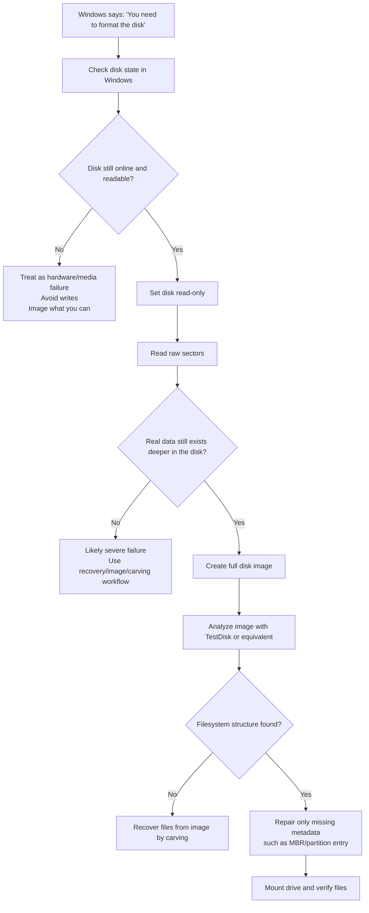

# Windows USB Drive Repair Playbook

<p align="center">
  <a href="README.zh-CN.md">
    
  </a>
  <a href="README.md">
    
  </a>
</p>

This repository explains how to repair a Windows USB flash drive that suddenly:

- appears as `RAW`
- triggers the "You need to format the disk" prompt
- is still detected by Windows, but the files cannot be opened

This is a general recovery guide for normal Windows users.

## Typical Windows Prompt

If Windows shows a format prompt like this, and the USB drive had been working just moments ago, this playbook may apply:


## Desktop Tool

For most people, the easiest option is now the desktop executable:

- [dist/UsbRepairTool.exe](dist/UsbRepairTool.exe)

What it does:

- shows a real window instead of a terminal
- lets you choose a USB disk from a list
- lets you choose an output folder
- can create a full image backup first
- only writes a minimal MBR if the safe pattern is confirmed

The executable requests administrator rights automatically when launched.

## Simple Guided Script

For non-technical users, this repository now includes a guided Windows script:

- [Start-Repair-Format-Prompt.cmd](Start-Repair-Format-Prompt.cmd)

You can download the repository, then double-click the `.cmd` file. The script will request administrator rights by itself.

What it does:

- asks you to choose a USB disk from a list
- sets the disk read-only first
- backs up the first 1 MiB automatically
- optionally creates a full disk image
- checks whether the disk matches the safe auto-fix pattern
- writes back only a minimal MBR if the pattern is confirmed

Important limitation:

This script only auto-fixes one specific case:

- the MBR is missing or broken
- a valid FAT32 filesystem still exists

If the script cannot confirm that pattern, it stops instead of guessing.

## What This Problem Usually Means

Very often, the USB drive is not "empty" or "fully dead".

What may actually be broken is only the metadata at the front of the disk, such as:

- the MBR partition table
- the partition entry
- the filesystem boot sector or related metadata

If the file area is still intact, Windows may still show a format prompt because it can no longer find the correct entry point into the existing filesystem.

## Typical Causes

This kind of problem often happens after one of these events:

- unsafe removal while files were still being written
- sudden power loss or USB disconnect during copy operations
- flash drive controller or firmware glitches
- bad sectors near the beginning of the drive
- partition-table corruption caused by disk tools or unexpected shutdowns
- aging, low-quality, or counterfeit flash media

## Recovery Strategy

The safest strategy is:

1. Do not format the drive.
2. Do not repair by guessing.
3. Back up the raw disk first if the data matters.
4. Identify whether the problem is hardware failure or metadata loss.
5. If the filesystem still exists, repair only the broken metadata layer.

## Diagram: Safe Repair Flow



## Diagram: Why Windows Says "Format"


## Step-by-Step Repair Approach

### 1. Check the Windows state first

Run:

```powershell
Get-Disk
Get-Partition
Get-Volume
Get-Disk -Number <n> | Format-List *
Get-Partition -DiskNumber <n> | Format-List *
Get-Volume -DriveLetter <letter> | Format-List *
cmd /c chkdsk <letter>:
```

Signs that this may be a metadata problem instead of total failure:

- the physical disk is still `Online`
- the disk health still looks normal
- the drive letter exists but the filesystem is `RAW`
- `chkdsk` reports that it cannot operate on a RAW drive

### 2. Freeze the disk before experimenting

If the files matter, set the disk read-only first:

```powershell
Set-Disk -Number <n> -IsReadOnly $true
```

This reduces the chance of accidental writes while diagnosing.

### 3. Inspect raw sectors

Read the first sectors and at least one later region of the disk.

Interpretation:

- if the first sectors are blank, corrupted, or full of `FF`, but later regions still contain real data, then the drive may have lost only its front metadata
- if the disk shows read errors everywhere, repeated disconnects, or cannot be imaged, treat it as hardware failure

### 4. Create a full disk image

Before writing anything back to the USB drive, create a sector-by-sector image.

This gives you:

- a rollback point
- a safe copy for recovery experiments
- a way to use tools like TestDisk without touching the original device first

### 5. Analyze the image

Use TestDisk or a similar recovery tool to search for:

- valid partitions
- FAT32/exFAT/NTFS structures
- a matching volume label
- plausible directory entries

If the root directory can be parsed and you can see real filenames, the filesystem may still be intact.

### 6. Repair only the smallest broken layer

If the filesystem is real and readable, but Windows cannot find it because the partition table is gone, then the correct fix may be very small:

- rebuild only the MBR
- restore only the missing partition entry
- do not reformat the whole drive

For a FAT32 removable drive, this often means writing a standard MBR with a correct start LBA and partition size.

### 7. Verify after repair

After Windows remounts the drive, verify:

```powershell
Get-Partition -DiskNumber <n>
Get-Volume -DriveLetter <letter>
Get-ChildItem <letter>:\ -Force
cmd /c fsutil dirty query <letter>:
```

Also read a few large files end-to-end or calculate hashes. Directory listing alone is not enough.

## When Minimal Repair Is Appropriate

Minimal metadata repair is appropriate when:

- the disk is still broadly readable
- the filesystem structure can be confirmed from the image
- the start offset and geometry are known
- the user data area is still intact

## When Minimal Repair Is Not Appropriate

Do not do direct metadata repair first if:

- the drive keeps disconnecting
- there are many read errors across the whole device
- the storage controller looks unstable
- you cannot confirm the real filesystem layout

In those cases, prioritize imaging and file recovery, not in-place repair.

## What Not To Do

- Do not click the Windows format prompt.
- Do not run write-heavy repair before imaging if the data matters.
- Do not guess partition geometry and write it to the original disk without validation.
- Do not assume the drive is empty just because Windows says it must be formatted.

## Real-World Outcome Behind This Guide

In the recovery case behind this repository:

- the first disk sector was damaged
- the USB drive looked unreadable to Windows
- the real FAT32 filesystem still existed deeper in the disk
- the root directory could still be parsed from the image
- restoring a minimal MBR was enough to make the drive mount again

That is why this guide focuses on safe diagnosis first and minimal repair second.
