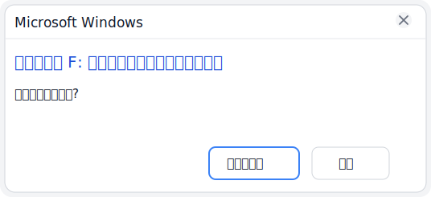
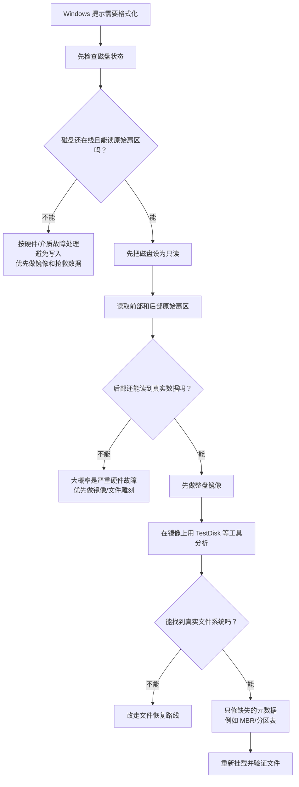

# Windows U盘修复指南

<p align="center">
  <a href="README.zh-CN.md">
    
  </a>
  <a href="README.md">
    
  </a>
</p>

这个仓库整理的是一套给普通 Windows 用户看的 U 盘修复思路，适用于下面这类情况：

- U 盘突然提示“使用驱动器之前需要将其格式化”
- 盘符还在，但打不开
- 文件系统显示为 `RAW`
- Windows 能识别到设备，但读不到文件
- U 盘中毒后文件全部被隐藏，看起来像空盘
- 文件夹变成一堆快捷方式
- 文件重新显示后，名称出现乱码

核心目的是告诉别人：这种情况不一定是数据没了，很多时候只是盘头的元数据损坏了。

## 典型提示示意图

如果你看到的提示和下面这类窗口很像，而且这块 U 盘刚刚还好好的，那么这套“先判断、后小修、不要立刻格式化”的思路就很适用：



## 桌面版一键工具

如果你完全不想碰命令行，现在最简单的入口已经变成桌面版 exe：

- [dist/UsbRepairTool.exe](dist/UsbRepairTool.exe)

它现在能做的事：

- 打开一个真正的图形界面窗口
- 直接从列表里选择 USB 磁盘
- 选择输出目录
- 可选先做整盘镜像备份
- 只有在确认安全时才回写最小 MBR

双击后，它会自动申请管理员权限。

## 另一类常见问题：文件被隐藏、出现快捷方式、文件名乱码

还有一种很常见的情况，不是分区表坏了，而是 U 盘中毒后把真实文件全部改成了 `隐藏 + 系统`，表面看起来像空了，然后再冒出一堆快捷方式。

典型表现：

- U 盘看起来空空的
- 文件夹变成 `.lnk` 快捷方式
- 根目录出现 `autorun.inf` 或可疑脚本文件
- 文件恢复可见后，名字仍然有乱码

针对这种情况，现在仓库里也附带了一键入口：

- [Start-Recover-Hidden-Files.cmd](Start-Recover-Hidden-Files.cmd)

它会做这些事：

- 列出 USB 磁盘让用户选择
- 自动去掉文件和文件夹的 `隐藏 / 只读 / 系统` 属性
- 生成修复前后的清单报告
- 可选把根目录常见的快捷方式病毒文件移到隔离区
- 对“乱码文件名”给出下一步处理建议

要注意的是：

- 它能恢复“被隐藏”的文件显示，但不能保证自动修复所有乱码文件名
- 如果只是文件名乱码，但文件内容还能正常打开，先复制到硬盘，再在硬盘里改名
- 如果文件名和文件内容都已经异常，那就要改走文件恢复路线，而不是只做属性修复

## 小白也能用的引导脚本

如果你不想自己敲命令，这个仓库现在附带了一个可直接双击运行的入口脚本：

- [Start-Repair-Format-Prompt.cmd](Start-Repair-Format-Prompt.cmd)

下载仓库后，直接双击这个 `.cmd` 文件就可以。脚本会自己申请管理员权限。

它会自动做这些事：

- 先列出当前所有 USB 磁盘，让你选盘
- 先把目标磁盘设成只读
- 自动备份前 1 MiB 盘头
- 可选做整盘镜像
- 自动判断这块盘是不是“MBR 丢失但 FAT32 还在”的情况
- 只有确认符合时，才回写一个最小 MBR

这个脚本不是万能修盘工具，它只自动修一种已经验证过的场景：

- `MBR` 丢失或损坏
- `FAT32` 文件系统主体仍然存在

如果脚本无法确认这一点，它会主动停止，不会瞎写盘。

## 这类问题通常意味着什么

很多人一看到“需要格式化”就以为整个 U 盘都坏了。其实常见情况是：

- 盘里的文件数据还在
- 文件系统主体还在
- 真正坏掉的是磁盘最前面的元数据

常见损坏位置包括：

- `MBR` 分区表
- 分区入口
- 文件系统启动扇区相关信息

Windows 找不到原来那套文件系统的入口时，就会弹出格式化提示。

## 什么时候容易出现这种情况

这类问题常见于下面几种场景：

- 正在复制文件时直接拔盘
- 写入过程中突然断电、断连
- U 盘主控或固件偶发异常
- U 盘前部扇区出现坏块
- 分区表被磁盘工具或异常关机破坏
- 老化、质量差、扩容盘、假盘
- U 盘插过带快捷方式病毒的电脑
- 病毒把文件改成隐藏属性并伪造快捷方式
- 文件刚恢复可见时，目录项已经受损，导致名称乱码

## 总体修复思路

安全优先的顺序应该是：

1. 不要格式化
2. 不要先乱修
3. 如果数据重要，先保护原盘
4. 先判断是硬件坏，还是只是元数据坏
5. 如果文件系统还在，就只修最小损坏层

## 图解 1：安全修复流程



## 图解 2：为什么会弹出“需要格式化”


## 普通人该怎么修

下面是通用做法，不需要额外的专业开发环境。

### 第一步：先看系统状态

先在 Windows PowerShell 里看：

```powershell
Get-Disk
Get-Partition
Get-Volume
Get-Disk -Number <n> | Format-List *
Get-Partition -DiskNumber <n> | Format-List *
Get-Volume -DriveLetter <letter> | Format-List *
cmd /c chkdsk <letter>:
```

如果看到这种组合，就很像“元数据损坏”而不是“整盘没了”：

- 物理磁盘还是 `Online`
- 磁盘健康状态还正常
- 盘符存在但文件系统变成 `RAW`
- `chkdsk` 提示 RAW 盘无法检查

### 第二步：先保护原盘

如果数据重要，先把盘设成只读：

```powershell
Set-Disk -Number <n> -IsReadOnly $true
```

这样可以避免误写。

### 第三步：读取原始扇区

先读最前面几个扇区，再读磁盘后面一点的位置。

怎么判断：

- 如果前面扇区是空的、全 `FF`、或者明显异常，但后面的区域还有正常数据，那通常说明只是盘头坏了
- 如果整盘到处报读错、反复断开、镜像都做不出来，那更像硬件坏了

### 第四步：先做整盘镜像

在真正往 U 盘里写任何内容之前，先做一份按扇区的整盘镜像。

这样做有三个好处：

- 出错时还能回退
- 后续分析可以在镜像上做
- 不会一边修一边把原盘越修越糟

### 第五步：在镜像上找真实文件系统

推荐用 TestDisk 这类工具去找：

- 真实分区
- FAT32/exFAT/NTFS 结构
- 原来的卷标
- 根目录和文件名

如果在镜像里已经能看到真实文件名，那就说明文件系统很可能还在。

### 第六步：只修最小损坏层

如果确认数据区和文件系统都还在，但 Windows 只是找不到入口，那就不要整盘重建。

正确做法通常是：

- 只补 `MBR`
- 或只补分区表入口
- 不要直接格式化整个 U 盘

以 FAT32 为例，很多时候只要把“这个分区从哪里开始、长度是多少”写回 MBR，Windows 就能重新挂载。

### 第七步：修完后做验证

修完以后不要只看“盘能打开了”，还要继续验证：

```powershell
Get-Partition -DiskNumber <n>
Get-Volume -DriveLetter <letter>
Get-ChildItem <letter>:\ -Force
cmd /c fsutil dirty query <letter>:
```

另外最好再读几个大文件，或者算一下哈希，确认 FAT 链和数据读取都正常。

## 什么时候适合做这种“最小修复”

适合的前提是：

- 这块盘整体还能读
- 在镜像里能确认真实文件系统
- 能确认分区起点和大小
- 数据区本身还在

## 什么时候不适合直接这样修

下面这些情况，更应该先抢救数据，而不是直接原地修盘：

- U 盘反复掉线
- 全盘很多位置都读不出来
- 主控不稳定
- 根本无法确认真实文件系统布局

这时候应该优先做镜像、做文件恢复，而不是立刻往原盘回写元数据。

## 不要做的事

- 不要点 Windows 弹出来的“格式化磁盘”
- 如果数据重要，不要在没做镜像前就写盘修复
- 不要凭猜测去写分区表
- 不要因为 Windows 提示格式化，就默认整个盘已经空了

## 这个仓库背后的真实案例

这个仓库对应的那次修复，实际情况是：

- 第 0 扇区坏了
- Windows 认为这盘打不开
- 真正的 FAT32 文件系统还在后面
- 从镜像里仍然能解析出根目录和文件名
- 最后只补回一个最小 MBR，U 盘就重新挂载成功了

所以这份指南强调的是：

先判断，后修复；先保数据，后写盘；能小修，就不要大修。
